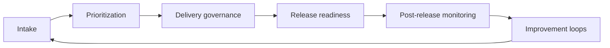

# Enterprise AI Governance Playbook

An end-to-end operating playbook for enterprise AI, from intake and prioritization through release, monitoring, and continuous improvement.

## Choose this repo when

Use this repository when you need the **organizational operating model** for AI:

- intake and prioritization
- lifecycle governance
- monitoring and improvement loops
- templates for recurring governance work

If you need a **specific release-stage framework**, use [`release-governance`](https://github.com/simaba/release-governance).

If you need a **working validator**, use [`release-checklist`](https://github.com/simaba/release-checklist).

If you need a **starter template repo**, use [`regulated-ai`](https://github.com/simaba/regulated-ai).

## Playbook lifecycle

## What is included

### Playbook phases

| Phase | Document |
|---|---|
| Intake | `playbook/intake.md` |
| Prioritization | `playbook/prioritization.md` |
| Release | `playbook/release.md` |
| Monitoring | `playbook/monitoring.md` |
| Improvement | `playbook/improvement.md` |

### Lean Six Sigma integration

| Topic | Document |
|---|---|
| AI operating model | `lean-six-sigma/ai-operating-model.md` |
| Metrics and CTQs | `lean-six-sigma/metrics-and-ctqs.md` |

### Templates

| Template | Use for |
|---|---|
| `templates/intake-form.md` | Capturing AI project requests |
| `templates/prioritization-matrix.csv` | Scoring and ranking initiatives |
| `templates/improvement-review.md` | Post-release retrospectives |

## Related repositories

| Repository | What it adds |
|---|---|
| [release-governance](https://github.com/simaba/release-governance) | Release-stage governance framework |
| [release-checklist](https://github.com/simaba/release-checklist) | CLI validation for release-readiness configs |
| [nist-rmf-guide](https://github.com/simaba/nist-rmf-guide) | NIST AI RMF implementation guide |
| [regulated-ai](https://github.com/simaba/regulated-ai) | Starter template repo |
| [lean-ai-ops](https://github.com/simaba/lean-ai-ops) | Process-improvement app and analytics |

---

*Shared in a personal capacity. Open to collaborations and feedback via [LinkedIn](https://linkedin.com/in/simaba) or [Medium](https://medium.com/@bagheri.sima).*
