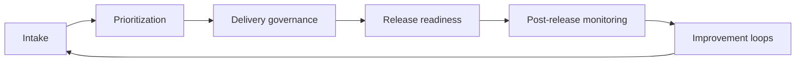

# Enterprise AI Governance Playbook

An end-to-end operating playbook for enterprise AI, from intake and prioritization through release, monitoring, and continuous improvement.

## Choose this repo when

Use this repository when you need the **organizational operating model** for AI:

- intake and prioritization
- lifecycle governance
- monitoring and improvement loops
- templates for recurring governance work
- governance forums, decision rights, and escalation paths

If you need a **specific release-stage framework**, use [`release-governance`](https://github.com/simaba/release-governance).

If you need a **working validator**, use [`release-checklist`](https://github.com/simaba/release-checklist).

If you need a **starter template repo**, use [`regulated-ai`](https://github.com/simaba/regulated-ai).

## Maturity

This is a **practitioner playbook**. It is intended to help teams structure operating-model discussions, governance routines, decision rights, escalation paths, and continuous-improvement loops. It is not a certified governance system or a substitute for organization-specific legal, compliance, safety, privacy, or security review.

## Playbook lifecycle

```mermaid
flowchart LR
    A[Intake] --> B[Prioritization]
    B --> C[Delivery governance]
    C --> D[Release readiness]
    D --> E[Post-release monitoring]
    E --> F[Improvement loops]
    F --> A
```

## What is included

### Playbook phases

| Phase | Document |
|---|---|
| Intake | `playbook/intake.md` |
| Prioritization | `playbook/prioritization.md` |
| Release | `playbook/release.md` |
| Monitoring | `playbook/monitoring.md` |
| Improvement | `playbook/improvement.md` |

### Operating model artifacts

| Artifact | Use for |
|---|---|
| `templates/ai-governance-operating-model.md` | Defining governance forums, decision rights, lifecycle controls, metrics, and escalation rules |
| `examples/sample-ai-governance-operating-model.md` | Seeing a filled generic example of the operating model in practice |

### Lean Six Sigma integration

| Topic | Document |
|---|---|
| AI operating model | `lean-six-sigma/ai-operating-model.md` |
| Metrics and CTQs | `lean-six-sigma/metrics-and-ctqs.md` |

### Templates

| Template | Use for |
|---|---|
| `templates/intake-form.md` | Capturing AI project requests |
| `templates/prioritization-matrix.csv` | Scoring and ranking initiatives |
| `templates/improvement-review.md` | Post-release retrospectives |
| `templates/ai-governance-operating-model.md` | Designing an AI governance operating model |

## Relationship to the release repos

| Repository | Role |
|---|---|
| `governance-playbook` | portfolio-level AI operating model across intake, prioritization, release, monitoring, and improvement |
| `release-governance` | release-stage gate framework and release decision artifacts |
| `release-checklist` | executable YAML validator for release-readiness checks |

## Scope and disclaimer

This repository is shared in a personal capacity. It is not legal advice, compliance certification, regulatory approval, safety certification, or official guidance from NIST, the EU, ISO, or any employer.

References to AI governance, risk management, release readiness, decision rights, and operating models are practitioner examples. Always adapt them to the specific organization, system risk, jurisdiction, and internal approval structure.

## Related repositories

| Repository | What it adds |
|---|---|
| [release-governance](https://github.com/simaba/release-governance) | Release-stage governance framework |
| [release-checklist](https://github.com/simaba/release-checklist) | CLI validation for release-readiness configs |
| [nist-rmf-guide](https://github.com/simaba/nist-rmf-guide) | NIST AI RMF implementation guide |
| [regulated-ai](https://github.com/simaba/regulated-ai) | Starter template repo |
| [lean-ai-ops](https://github.com/simaba/lean-ai-ops) | Process-improvement app and analytics |

---

*Shared in a personal capacity. Open to collaborations and feedback via [LinkedIn](https://linkedin.com/in/simaba) or [Medium](https://medium.com/@bagheri.sima).*
